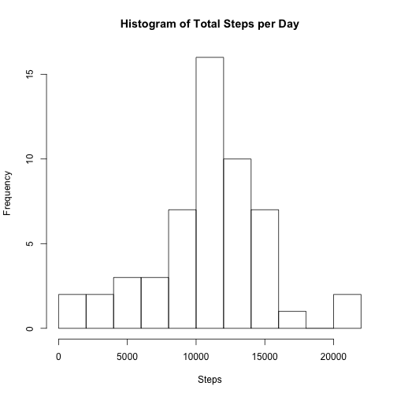
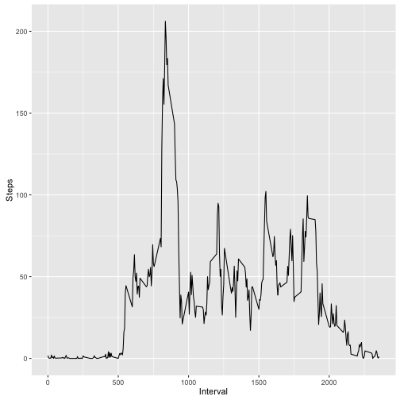
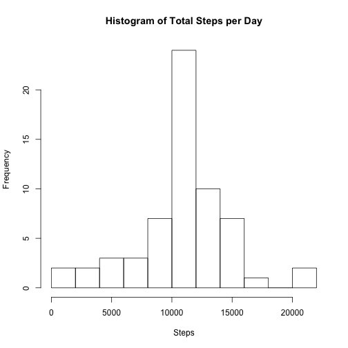
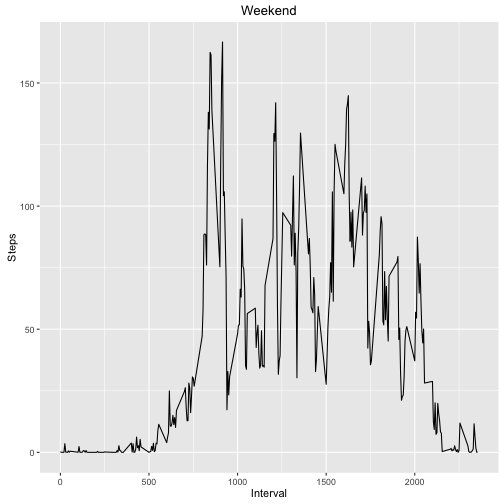
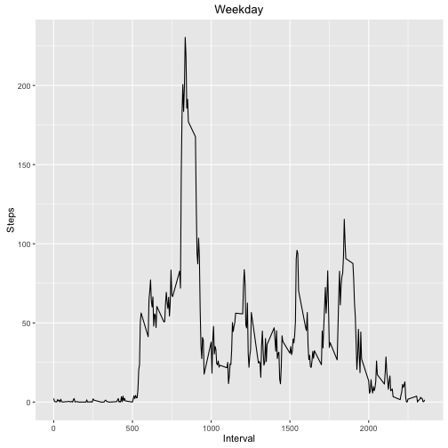

Reproducible Research Course Project 1
======================================

In this assignment, we are going to make use of personal movement data collected from activity tracking monitors. 

These data consist of such data from a personal activity tracking monitor collected on a single individual over 2 months in 5 minute intervals. 

The variables included in this dataset are:

* steps: Number of steps taking in a 5-minute interval (missing values are coded as 𝙽𝙰)
* date: The date on which the measurement was taken in YYYY-MM-DD format
* interval: Identifier for the 5-minute interval in which measurement was taken

For our first analysis, let's start by loading in the data.


```r
library(ggplot2)
library(dplyr)

URL <- "https://d396qusza40orc.cloudfront.net/repdata%2Fdata%2Factivity.zip"
download.file(URL, destfile = "/Users/andrewcowan/Desktop/Reproducible_Research/repdata.zip")
data00 <- read.csv(unzip("/Users/andrewcowan/Desktop/Reproducible_Research/repdata.zip"))
```

Let's start by looking at the total number of steps per day. 


```r
data0 <- na.omit(data00)
data0$date <- as.character(data0$date)
data1 <- group_by(data0, date)
data2 <- summarise(data1, steps_tot = sum(steps))
print(data2, n = 53)
```

```
## Source: local data frame [53 x 2]
## 
##          date steps_tot
##         <chr>     <int>
## 1  2012-10-02       126
## 2  2012-10-03     11352
## 3  2012-10-04     12116
## 4  2012-10-05     13294
## 5  2012-10-06     15420
## 6  2012-10-07     11015
## 7  2012-10-09     12811
## 8  2012-10-10      9900
## 9  2012-10-11     10304
## 10 2012-10-12     17382
## 11 2012-10-13     12426
## 12 2012-10-14     15098
## 13 2012-10-15     10139
## 14 2012-10-16     15084
## 15 2012-10-17     13452
## 16 2012-10-18     10056
## 17 2012-10-19     11829
## 18 2012-10-20     10395
## 19 2012-10-21      8821
## 20 2012-10-22     13460
## 21 2012-10-23      8918
## 22 2012-10-24      8355
## 23 2012-10-25      2492
## 24 2012-10-26      6778
## 25 2012-10-27     10119
## 26 2012-10-28     11458
## 27 2012-10-29      5018
## 28 2012-10-30      9819
## 29 2012-10-31     15414
## 30 2012-11-02     10600
## 31 2012-11-03     10571
## 32 2012-11-05     10439
## 33 2012-11-06      8334
## 34 2012-11-07     12883
## 35 2012-11-08      3219
## 36 2012-11-11     12608
## 37 2012-11-12     10765
## 38 2012-11-13      7336
## 39 2012-11-15        41
## 40 2012-11-16      5441
## 41 2012-11-17     14339
## 42 2012-11-18     15110
## 43 2012-11-19      8841
## 44 2012-11-20      4472
## 45 2012-11-21     12787
## 46 2012-11-22     20427
## 47 2012-11-23     21194
## 48 2012-11-24     14478
## 49 2012-11-25     11834
## 50 2012-11-26     11162
## 51 2012-11-27     13646
## 52 2012-11-28     10183
## 53 2012-11-29      7047
```

Next, let's look a histogram of the total number of steps per day.


```r
hist(data2$steps_tot, breaks = 12, main = "Histogram of Total Steps per Day", xlab = "Steps")
```



Then, let's calculate the mean and median steps taken per day:


```r
mean(data2$steps_tot)
```

```
## [1] 10766.19
```

```r
median(data2$steps_tot)
```

```
## [1] 10765
```

Next, we are going to turn to the average daily activity pattern. We will start by creating a time series plot of the 5 minute interval and the average steps taken, averaged across all days.

First, we need to do some transformations of the data. Then we can create the plot.


```r
data3 <- data0
data4 <- group_by(data3, interval)
data5 <- summarise(data4, steps_ave = mean(steps))

ggplot(data5, aes(interval, steps_ave)) + geom_line() + xlab("Interval") + ylab("Steps")
```



Let's look closer at the data. We are most interested in which 5 minute interval on average, contains the maximum number of steps:


```r
data5[which(data5[,2] == max(max(data5$steps_ave))),1]
```

```
## Source: local data frame [1 x 1]
## 
##   interval
##      <int>
## 1      835
```

It looks like interval 835 contains the maximum average number of steps. This checks out when we look at the time series above.

Next, let's look at missing data. There are some missing data points in the set, denoted as NA. To start, let's look at the total number of missing data, by subtracting the number of rows in the original dataset, from the number in the dataset with NAs omitted:


```r
nrow(data00) - nrow(data0)
```

```
## [1] 2304
```

We need a strategy to fill in missing data. Let's use the mean steps for a given interval as the imputed data. We will create a new dataset called "data000". We will use "data5" which has the average number of steps taken per interval to fill in the missing data.


```r
data000 <- data00

for (i in 1:nrow(data00)){
  if (is.na(data00[i,1] == T)) {
    interval = data000[i, 3]
    data000[i, 1] = data5[which(data5$interval == interval),2]
  }
}
```

Similar to the first analysis, we will then create a histogram (with some transformations first) of the number of steps taken per day, now using the dataset with imputed values for NAs:


```r
data6 <- group_by(data000, date)
data7 <- summarise(data6, steps_tot = sum(steps))

hist(data7$steps_tot, breaks = 12, main = "Histogram of Total Steps per Day", xlab = "Steps")
```



Next, let's look at the median and mean number of steps per day in the new dataset, and compare with the original:


```r
mean(data7$steps_tot)
```

```
## [1] 10766.19
```

```r
median(data7$steps_tot)
```

```
## [1] 10766.19
```

The numbers don't look dramatically different. Imputing data to fill in missing NAs doesn't seem to have changed the dataset considerably.

Next, let's compare activity between the weekdays and weekends, using the "weekdays" function in R:


```r
data000$date <- as.Date(as.character(data000$date), format = "%Y-%m-%d")
data000$day <- weekdays(data000$date)
```

Next, let's use the dplyr function mutate to create a new variable, "wowd", to tell us whether a day is a weekend, or weekday:


```r
data0000 <- mutate(data000, wowd = ifelse(grepl("Sunday", day), "weekend",
ifelse(grepl("Saturday", day), "weekend", "weekday")))
```

Next, let's create time series plots for "weekend" and "weekday":


```r
weekend <- filter(data0000, wowd == "weekend")
weekend1 <- group_by(weekend, interval)
weekend2 <- summarise(weekend1, steps_ave = mean(steps))

weekday <- filter(data0000, wowd == "weekday")
weekday1 <- group_by(weekday, interval)
weekday2 <- summarise(weekday1, steps_ave = mean(steps))

ggplot(weekend2, aes(interval, steps_ave)) + geom_line() + ggtitle("Weekend") + xlab("Interval") + ylab("Steps")
```



```r
ggplot(weekday2, aes(interval, steps_ave)) + geom_line() + ggtitle("Weekday") + xlab("Interval") + ylab("Steps")
```



It looks like activity levels are much higher throughout the day on weekends, for this individual, as compared to weekdays.
